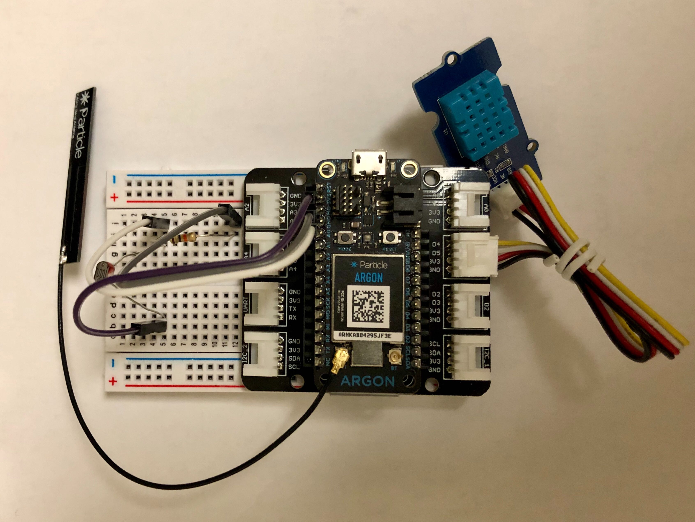
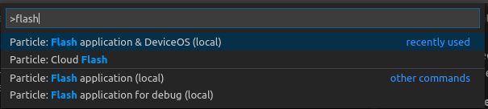
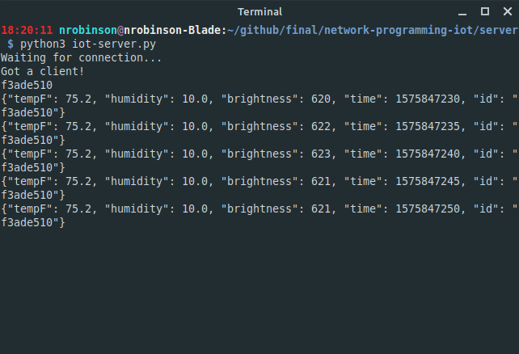
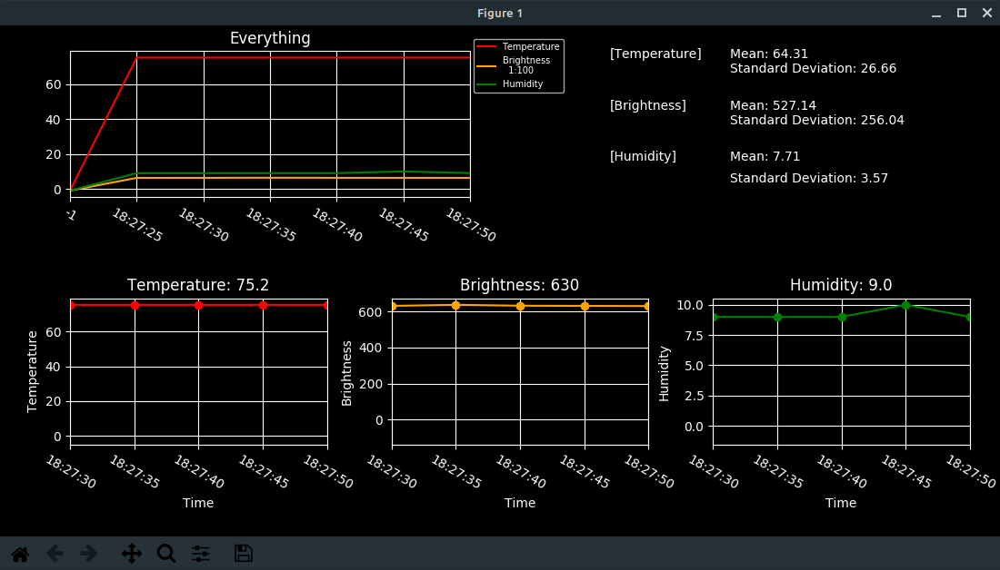

# IoT Sensor Network

## Description

For this project We created a distributed network of sensor nodes that collect environmental data (Temperature, Humidity, Brightness), into a queue of data points and locally transmit the data points to a server via TCP at a scheduled interval.

In addition to the sensor nodes and server, we created a graphing application that receives the stream of data points from the server and graphs them in real time for instant visualization.

We built the sensor nodes using [Particle Argon + Grove Sensor Kits](https://store.particle.io/products/iot-starter-kit), and we wrote the server and graphing applications in Python.

In the demo, we chose run the Python server and graphing applications on the same laptop that hosted the Wi-Fi hotspot that the Argons connected to.

[You can view our presentation slides here.](https://docs.google.com/presentation/d/1UNs1KHNIKJGHQrwOq8KRXnI_WiBQlWs4qDYuLd9ZOwg/edit?usp=sharing)



## Getting Started

### Installing the Application

Below are the necessary steps to install the required dependencies for running our project. To fully recreate this project you will need at least one Argon + Grove kit and will need to create a Wi-Fi hotspot on your PC using ethernet.

**Step 0: Clone this Repository with Git or Download a .zip**

You will need to have a local copy of this repository in order to compile or run any of the components.

```bash
git clone https://github.com/nrobinson2000/network-programming-iot
```

**Step 1: Download and Install Particle Workbench**

Particle Workbench is the official Visual Studio Code based IDE developed by Particle used for compiling, flashing, and debugging Particle applications on Particle's development boards.

Download the Particle Workbench installer from Particle's website.

https://www.particle.io/workbench#installation

**Step 2: Install Python**

You will need to have Python 3 installed in order to run the server and the graphing application. On Mac and Linux Python 3 usually comes pre-installed. On Windows you will probably need to download and run the Python 3 installer. https://www.python.org/downloads/

Additionally, you will need to install the following packages with pip3:

```
pip3 install pandas matplotlib
```

**Step 3: Setup the Wi-Fi hotspot on your PC**

You will need to run your Wi-Fi interface in hotspot mode and have established an ethernet connection. This is the network that the sensor nodes will connect to.

**Step 4: Assemble at least one Sensor Node and Flash Particle Firmware**

To assemble a sensor node you must insert an Argon into the Grove shield, connect the Wi-Fi antenna, plug the DHT11 temperature and humidity sensor into the D4 port on the shield, and then connect the photoresistor the A0 pin on the Argon with a 10K ohm resistor voltage divider.

Before compiling and flashing a Particle application to an Argon it's best to setup and claim the Argon to a Particle account via the mobile app. You can find the instructions and links here: https://setup.particle.io/

When the mobile app asks for a Wi-Fi network during the Argon setup process, make sure to select the network running from your PC.

Once the Argon has been added to your Particle account, open the `particle-client/` folder in Visual Studio Code. Under the `src/` folder you will find `particle-client.cpp` which is the primary source file for the application. By default, the `particle-client` application is configured to attempt to connect to a server running on port `1234` of the IP running the Wi-Fi hotspot the Argon is configured to connect to.

To compile and flash the Particle firmware to your Argon, open the Visual Studio Code Command Palette (CMD + SHIFT + P) or (CTRL + SHIFT + P), and run `Particle: Flash application & DeviceOS (local)`.

**NOTE: The Argon must be connected via USB to upload new firmware locally.**



It may take a few minutes to compile DeviceOS, so be patient. You may see a sequence of magenta flashes, this is a normal part of the bootloader update process.

When the application is running the boot sequence of the RGB should look like:

* White Pulse (Processor is Booting)
* Green Blinks (Connecting to Wi-Fi)
* Fast Cyan Blinks (Connecting to Particle Cloud)
* Slow Cyan Pulse (Connected to Particle Cloud, Syncing Time)
* Slow Green Pulse (Disconnected from Particle Cloud, Connected to Wi-Fi)

After the Argon has booted and connected to the server, it will automatically maintain it's Wi-Fi connection and socket connection with the server, reconnecting when necessary.

---

### Running the Application

Now that the firmware has been flashed to your Argon, running the application is pretty simple.

**Step 1: Start the Python server**

The Python server handles the JSON encoded data points sent by the sensor node clients and forwards them to the graphing application client. To start the python server, run the following from the `server/` directory in the repository:

```bash
python3 iot-server.py
```

A log of all the JSON data points received by the server is stored in the `JsonHolder.txt` file.

**Step 2: Connect the Sensor Node(s)**

Reset or connect each sensor node to power via USB. Each node should go through its RGB boot sequence within a few seconds and you should see it connect and then send some JSON data momentarily.



**Step 3: Connect the Graphing Application Client**

The Graph client connects to the server and receives all JSON data points forwarded by the server. It then graphs the data using a matplotlib window.

To start the Graph client, run the following from the `graph-client/` directory in the repository:

```bash
python3 graph.py
```

You will see a notification in the server when the Graph client connects. Once new JSON data is received by the server and forwarded to the Graph client, you will see the data displayed like this:



## Features

There are many different features in our project that are distributed across the three parts:

### Sensor Node Features

* Connects to the Particle Cloud to synchronize timestamps for data points.
* Connects to the Python server with a TCP socket to send JSON data.
* Uses a 5 second timer to collect and store sensor data in a queue.
* Uses a 30 second timer to transmit all sensor data points in JSON format to the server.
* Automatically reconnects to the server and Wi-Fi if connections are interrupted.

### Python Server Features

* Receives JSON payloads from sensor nodes.
* Sends JSON payloads to the graphing client.
* Uses dedicated threads for handling each client.

### Graphing Client Features

* Connects to the Python server with a TCP socket.
* Receives JSON payloads from the server.
* Parses JSON payloads into data points and graphs the data using matplotlib.
* Graphs Temperature, Brightness, and Humidity, and displays the calculated mean and standard deviation.

## Demo video

Upload your demo video to youtube and put a link here. Basically, the video content is very much like the quick live demo of your product with the followings:

1. Project description
2. How to run the app
3. Quick walkthrough of all the features of your app

LINK TO VIDEO HERE

## References

### General Troubleshooting
* [Stack Overflow](https://stackoverflow.com/) - Used to fix bugs with python development

### Python Libraries
* [matplotlib](https://matplotlib.org/) - Used to plot data in the graphing client

### Particle Libraries
* [PietteTech_DHT](https://github.com/eliteio/PietteTech_DHT) - Used to read temperature and humidity
* [TCPClient](https://docs.particle.io/reference/device-os/firmware/argon/#tcpclient) - Used to manage socket connection to python server

### Hardware
* [Particle IoT Starter Kit](https://store.particle.io/products/iot-starter-kit) - Includes Argon development board anbd 
* [USB C to Ethernet Adapter](https://www.amazon.com/gp/product/B077KXY71Q/)
* [Ethernet Cable](https://www.amazon.com/gp/product/B00N2VIALK/)
* [Jumper Wires](https://www.amazon.com/gp/product/B07GD1XFWV)
* [Photoresistors](https://www.amazon.com/gp/product/B07PF3CWW9)

## Team members

* Nathan Robinson, Particle Developer
* Phat Duong, Python Graph Developer
* William Serpa, Python Server Developer
